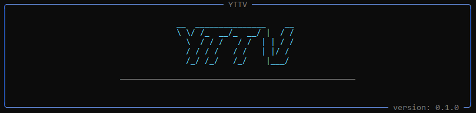

### YTTV — Утилита для работы с YouTube


> YTTV — это простая обёртка над `yt-dlp` с интерфейсом на основе `rich`.  
> Позволяет скачивать видео и плейлисты с YouTube в CLI без лишнего мусора.

---

> ⚠️ ВНИМАНИЕ: В настоящее время `yt-dlp` не работает из-за изменений в API YouTube. Программа может быть неработоспособна до обновления библиотеки.

### Особенности

- Скачивает видео и плейлисты с YouTube
- Автоматическая повторная попытка при сбоях сети (настраивается)
- Сохраняет файлы в указанную директорию (`downloaded/`)
- Логирует все действия в файл (`logs/yttv.log`)
- Установка через `uv`

---

### Установка

YTTV устанавливается через `uv`
#### Шаг 1: Установка `uv`

```bash
curl -LsSf https://astral.sh/uv/install.sh | sh
```

Через pip:

```bash
pip install uv
```

#### Шаг 2: Установи зависимости проекта

Вариант 1: Через `uv` (рекомендуется)

```bash
uv sync --no-dev
```

Вариант 2: Через `requirements.txt`

```bash
uv pip install -r requirements.txt
```

---

### Настройка

Перед использованием программы необходимо настроить конфигурацию в файле `pyproject.toml`.

#### Важно: Настройка FFmpeg

Обязательно укажите путь до исполняемого файла `ffmpeg` в параметре `ffmpeg_path`:

```toml
[settings]
ffmpeg_path = "bin/win/ffmpeg/ffmpeg.exe"  # Укажите путь до ffmpeg на вашем компьютере
```

Как получить FFmpeg:

1. **Скачать готовую сборку:**
   - Windows: [ffmpeg.org/download.html](https://ffmpeg.org/download.html)
   - Linux: `sudo apt install ffmpeg` или `sudo pacman -S ffmpeg`
   - macOS: `brew install ffmpeg`

2. Указать полный путь:
   - Windows: `ffmpeg_path = "C:/path/to/ffmpeg.exe"` или `ffmpeg_path = "C:\\path\\to\\ffmpeg.exe"`"
   - Linux/macOS: `ffmpeg_path = "/usr/bin/ffmpeg"` (или путь, где установлен)

3. Проверить установку:
   ```bash
   ffmpeg -version
   ```

#### Все настройки в `pyproject.toml`

```toml
[settings]
# Путь до исполняемого файла ffmpeg (ОБЯЗАТЕЛЬНО к настройке!)
ffmpeg_path = "bin/win/ffmpeg/ffmpeg.exe"

# Директория для сохранения скачанных файлов
output_dir = "downloaded"

# Количество повторных попыток при сетевых ошибках
network_retries = 3

# Таймаут сокета в секундах
network_socket_timeout = 5

# HTTP заголовки для имитации браузера
network_http_headers = "Mozilla/5.0 (iPhone; CPU iPhone OS 17_5 like Mac OS X) AppleWebKit/605.1.15 (KHTML, like Gecko) Version/17.5 Mobile/15E148 Safari/604.1"

# Разрешённые домены YouTube
domains_youtube = ["www.youtube.com", "youtube.com", "youtu.be"]

[logging]
# Имя файла лога
filename = "yttv.log"

# Директория для логов
logs_catalog = "logs"

# Уровень логирования (DEBUG, INFO, WARNING, ERROR, CRITICAL)
log_level = "INFO"

# Количество резервных копий логов
log_backup_count = 3

# Максимальный размер лог-файла в мегабайтах
log_mb = 5
```

---

### Использование

Запусти программу:

```bash
python run.py
```

Или через `uv`:

```bash
uv run python run.py
```

### Структура проекта

```
yttv/
├── bin/              # Исполняемые файлы (например, ffmpeg)
├── downloaded/       # Скачанные видео (настраивается)
├── logs/             # Логи программы
├── src/              # Исходный код
├── tests/            # Тесты
├── pyproject.toml    # Конфигурация проекта и настройки
├── requirements.txt  # Зависимости (автогенерируется)
├── run.py            # Точка входа
└── README.md         # Этот файл
```

---

### Требования

- Python >= 3.13
- FFmpeg (должен быть установлен и настроен путь в `pyproject.toml`)
- `uv` (для установки зависимостей)

---

### Логирование

Все действия программы логируются в файл `logs/yttv.log`. Логи автоматически ротируются при достижении максимального размера (`log_mb` мегабайт), сохраняется указанное количество резервных копий (`log_backup_count`).

---

### Решение проблем

#### Ошибка "ffmpeg not found"

Убедитесь, что:
1. FFmpeg установлен на вашем компьютере
2. В `pyproject.toml` указан правильный путь до `ffmpeg` (или `ffmpeg.exe` на Windows)
3. Путь указан в формате, соответствующем вашей ОС

#### Ошибки сети

- Увеличьте `network_retries` в настройках
- Проверьте интернет-соединение
- Попробуйте изменить `network_http_headers` на другой User-Agent

---
